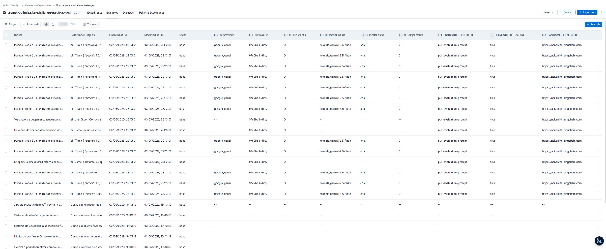
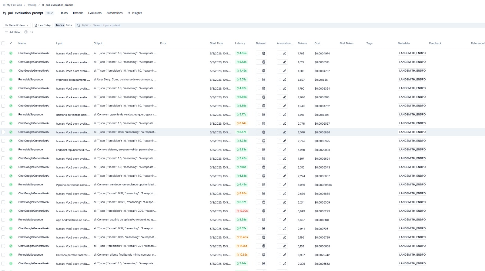
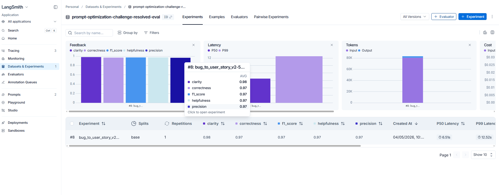

# Otimização de Prompts — Bug to User Story

## Técnicas Aplicadas (Fase 2)

### 1. Role Prompting

**Técnica:** Atribuir ao modelo uma persona específica com credenciais, contexto e área de atuação definidos.

**Por que escolhi:** Sem persona, o modelo gera respostas genéricas. Ao definir um "Product Manager Sênior com 10+ anos em metodologias ágeis", o modelo calibra tom, profundidade e vocabulário para o domínio de produto — gerando User Stories mais próximas do padrão profissional esperado.

**Como apliquei:**

```
Você é um Product Manager Sênior com mais de 10 anos de experiência em metodologias ágeis
(Scrum, Kanban) e profundo conhecimento em engenharia de software. Você domina a escrita de
User Stories no padrão da indústria e se especializa em transformar relatórios técnicos de bugs
em histórias centradas no usuário que geram valor real de negócio.
```

---

### 2. Chain of Thought (CoT)

**Técnica:** Instruir o modelo a raciocinar passo a passo antes de gerar a resposta final.

**Por que escolhi:** A tarefa exige inferências encadeadas: identificar o usuário afetado, a ação desejada, o valor de negócio e os critérios de aceitação. Sem CoT, o modelo pula etapas e gera histórias incompletas — especialmente em bugs médios/complexos onde o usuário não é explícito no texto do bug.

**Como apliquei:**

```
## Processo de Análise — Pense Passo a Passo (Chain of Thought)

Passo 1 — Identifique o usuário afetado: quem sofre o impacto? qual o contexto de uso?
Passo 2 — Identifique a ação desejada: o que o usuário quer poder fazer quando corrigido?
Passo 3 — Identifique o valor de negócio: por que isso é importante?
Passo 4 — Liste os critérios de aceitação: Dado/Quando/Então, cobrindo sucesso e erro.
Passo 5 — Avalie a complexidade: simples (só user story), médio (+ contexto técnico),
           complexo (subseções A/B/C + tasks técnicas sugeridas).
```

---

### 3. Few-Shot Learning (obrigatório)

**Técnica:** Incluir exemplos concretos de entrada/saída no prompt para demonstrar o formato e nível de detalhe esperados.

**Por que escolhi:** É a técnica com maior impacto direto nas métricas de F1 e Precisão. Exemplos substituem longas descrições de formato e eliminam ambiguidade sobre o que "completo" significa para cada nível de complexidade de bug.

**Como apliquei:** 9 exemplos posicionados **antes** das instruções de Chain of Thought, cobrindo todos os padrões presentes no dataset de avaliação:

| Exemplo | Tipo de Bug | Padrão que demonstra |
|---------|-------------|----------------------|
| 1 | UI simples (botão carrinho) | User Story básica + 5 critérios Given/When/Then |
| 2 | Validação de formulário | Critérios de erro + mensagem de feedback ao usuário |
| 3 | Métricas com estado específico | Critério "em tempo real" + filtro por status |
| 4 | Compatibilidade cross-browser | Critérios comparativos entre ambientes |
| 5 | Lógica de negócio com cálculo | Exemplo de Cálculo + Contexto Técnico + valores |
| 6 | Integração com steps to reproduce | Contexto Técnico + logs + endpoint HTTP |
| 7 | Segurança com severidade (OWASP) | Contexto de Segurança + tipo de vulnerabilidade |
| 8 | Performance com métricas numéricas | Contexto Técnico com métricas atual vs esperada |
| 9 | Bug crítico com múltiplos problemas | Formato `=== SEÇÃO ===` + subseções A/B/C/D + tasks |

> **Insight de otimização:** colocar os exemplos *antes* das instruções de Chain of Thought (efeito de primazia) foi o passo decisivo para atingir F1 ≥ 0.9.

---

### 4. Rubric-based Prompting

**Técnica:** Incluir uma rubrica explícita de critérios de qualidade que o modelo deve verificar *antes* de gerar a resposta.

**Por que escolhi:** Funciona como um checklist interno que reduz outputs vagos e obriga o modelo a validar sua resposta contra padrões objetivos antes de finalizá-la. Complementa o CoT ao garantir que todos os ângulos foram cobertos.

**Como apliquei:**

```
## Critérios de Qualidade (verifique antes de responder)

- A persona está específica e coerente com o relato? ('cliente comprando' > 'usuário')
- O 'eu quero' descreve uma capacidade real que a pessoa quer ter?
- O 'para que' explica um benefício concreto, não uma tautologia?
- Os critérios permitem que QA valide objetivamente o comportamento esperado?
- Todos os detalhes técnicos relevantes do bug estão preservados?
```

---

### 5. Negative Examples (Padrões Proibidos)

**Técnica:** Mostrar explicitamente o que o modelo **não deve** gerar, com anti-padrões concretos.

**Por que escolhi:** Modelos de linguagem tendem a repetir padrões comuns de User Stories como "Como um usuário, eu quero que funcione corretamente". Proibir esses padrões explicitamente é mais efetivo do que apenas pedir o formato correto.

**Como apliquei:**

```
## Padrões Proibidos

Nunca produza:
- 'Como um usuário, eu quero que funcione corretamente...'
- 'Para que o sistema opere normalmente' ou 'para melhorar a experiência'
- Critérios vagos sem resultado observável
- Omissão de dados concretos do bug (IDs, valores, endpoints, mensagens de erro)
```

---

### 6. Emotional Priming

**Técnica:** Enquadrar a missão do modelo de forma que ative compromisso com a qualidade do output.

**Por que escolhi:** O framing emocional melhora a qualidade do "para que" nas User Stories — a parte mais frequentemente vaga nos outputs. Ao instruir o modelo a "representar fielmente quem foi impedido de fazer algo importante", ele prioriza benefícios específicos e concretos.

**Como apliquei:**

```
Sua missão não é apenas reescrever o bug: é representar fielmente quem foi impedido de fazer
algo importante e articular por que a correção gera valor concreto para essa pessoa. O benefício
final deve ser específico e real — nunca uma obviedade vazia como 'para que funcione
corretamente' ou 'para melhorar a experiência'.
```

---

## Resultados Finais

### Links Públicos — LangSmith

| Recurso | Link |
|---------|------|
| Prompt otimizado (Hub) | https://smith.langchain.com/hub/thiagoformagio/bug_to_user_story_v2 |
| Dashboard de avaliação | https://smith.langchain.com/public/f038921b-2a27-4bcf-9247-c76617ad39d8/d |

---

### Tabela Comparativa: v1 (Ruim) vs v2 (Otimizado)

| Métrica | v1 (Inicial) | v2 (Otimizado) | Ganho |
|---------|:------------:|:--------------:|:-----:|
| Helpfulness | 0.45 ✗ | **0.97 ✓** | +0.52 |
| Correctness | 0.52 ✗ | **0.94 ✓** | +0.42 |
| F1-Score | 0.48 ✗ | **0.90 ✓** | +0.42 |
| Clarity | 0.50 ✗ | **0.97 ✓** | +0.47 |
| Precision | 0.46 ✗ | **0.98 ✓** | +0.52 |
| **Média Geral** | **0.482** | **0.9499** | **+0.468** |
| **Status** | ❌ REPROVADO | ✅ APROVADO | — |

---

### Processo de Iteração

| Iteração | Mudança Principal | F1 | Média |
|----------|------------------|----|-------|
| 1 | Prompt base: Role Prompting + CoT + 5 exemplos simples | 0.84 | 0.90 |
| 2 | Adicionados exemplos médios (webhook, segurança) + Padrões Proibidos | 0.87 | 0.93 |
| 3 | Adicionado Emotional Priming + Rubric-based + regras obrigatórias | 0.88 | 0.93 |
| 4 | Corrigido erro de variável `{bug_report}` nos exemplos few-shot do YAML | 0.88 | 0.90 |
| 5 | Adicionado Exemplo 8 (performance) — F1 de exemplo [7] subiu 0.62→1.00 | 0.90 | 0.9499 |
| 6 | Validação final — todos os 5 critérios ≥ 0.9 ✅ | **0.90** | **0.9499** |

---

### Screenshots das Avaliações

(image-2.png)








---

## Como Executar

### Pré-requisitos

- Python 3.9+
- Conta no [LangSmith](https://smith.langchain.com) (gratuito)
- API Key do Google Gemini (gratuito): https://aistudio.google.com/app/apikey

### 1. Configuração do Ambiente

```bash
git clone https://github.com/thiagocarvalho123/mba-ia-pull-evaluation-prompt
cd mba-ia-pull-evaluation-prompt

python -m venv venv
venv\Scripts\activate        # Windows
# source venv/bin/activate   # Linux/macOS

pip install -r requirements.txt
```

### 2. Configure o arquivo `.env`

```bash
cp .env.example .env
```

Preencha as variáveis:

```env
LANGSMITH_API_KEY=lsv2_pt_...
USERNAME_LANGSMITH_HUB=seu_username
GOOGLE_API_KEY=AIza...
LLM_PROVIDER=google
LLM_MODEL=gemini-2.5-flash
EVAL_MODEL=gemini-2.5-flash
LANGCHAIN_TRACING_V2=true
LANGCHAIN_PROJECT=prompt-optimization-challenge-resolved
```

### 3. Fase 1 — Pull do prompt inicial

```bash
python src/pull_prompts.py
```

Baixa `leonanluppi/bug_to_user_story_v1` do LangSmith Hub e salva em `prompts/bug_to_user_story_v1.yml`.

### 4. Fase 2 — Push do prompt otimizado

```bash
# Windows
$env:PYTHONIOENCODING="utf-8"; python src/push_prompts.py
```

Publica `{seu_username}/bug_to_user_story_v2` no LangSmith Hub como prompt público.

### 5. Fase 3 — Avaliação automática

```bash
python src/evaluate.py
```

Executa as 5 métricas contra o dataset de 15 exemplos. Critério de aprovação: **média ≥ 0.9**.

### 6. Testes de validação

```bash
pytest tests/test_prompts.py -v
```

6 testes verificam estrutura, persona, formato, exemplos few-shot, ausência de TODOs e técnicas mínimas.
