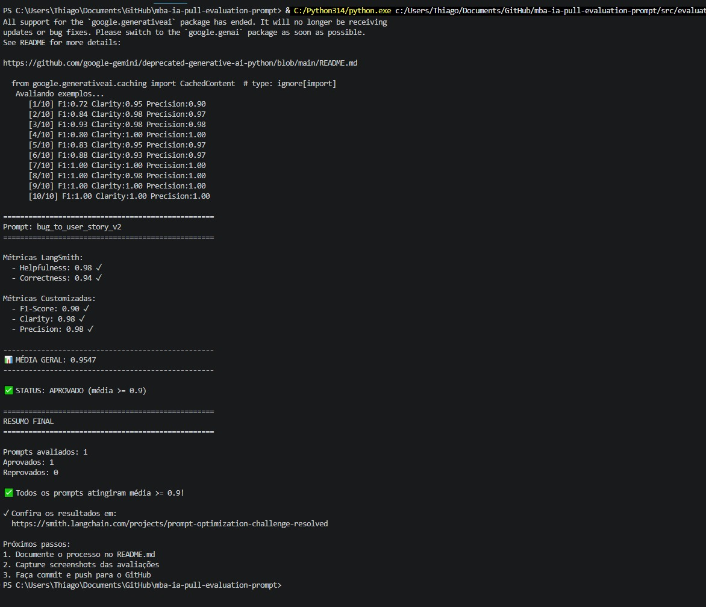

# Pull, Otimização e Avaliação de Prompts com LangChain e LangSmith

## Objetivo

Você deve entregar um software capaz de:

1. **Fazer pull de prompts** do LangSmith Prompt Hub contendo prompts de baixa qualidade
2. **Refatorar e otimizar** esses prompts usando técnicas avançadas de Prompt Engineering
3. **Fazer push dos prompts otimizados** de volta ao LangSmith
4. **Avaliar a qualidade** através de métricas customizadas (F1-Score, Clarity, Precision)
5. **Atingir pontuação mínima** de 0.9 (90%) em todas as métricas de avaliação

---

## Exemplo no CLI

```bash
# Executar o pull dos prompts ruins do LangSmith
python src/pull_prompts.py

# Executar avaliação inicial (prompts ruins)
python src/evaluate.py

Executando avaliação dos prompts...
================================
Prompt: support_bot_v1a
- Helpfulness: 0.45
- Correctness: 0.52
- F1-Score: 0.48
- Clarity: 0.50
- Precision: 0.46
================================
Status: FALHOU - Métricas abaixo do mínimo de 0.9

# Após refatorar os prompts e fazer push
python src/push_prompts.py

# Executar avaliação final (prompts otimizados)
python src/evaluate.py

Executando avaliação dos prompts...
================================
Prompt: support_bot_v2_optimized
- Helpfulness: 0.94
- Correctness: 0.96
- F1-Score: 0.93
- Clarity: 0.95
- Precision: 0.92
================================
Status: APROVADO ✓ - Todas as métricas atingiram o mínimo de 0.9
```
---

## Tecnologias obrigatórias

- **Linguagem:** Python 3.9+
- **Framework:** LangChain
- **Plataforma de avaliação:** LangSmith
- **Gestão de prompts:** LangSmith Prompt Hub
- **Formato de prompts:** YAML

---

## Pacotes recomendados

```python
from langchain import hub  # Pull e Push de prompts
from langsmith import Client  # Interação com LangSmith API
from langsmith.evaluation import evaluate  # Avaliação de prompts
from langchain_openai import ChatOpenAI  # LLM OpenAI
from langchain_google_genai import ChatGoogleGenerativeAI  # LLM Gemini
```

---

## OpenAI

- Crie uma **API Key** da OpenAI: https://platform.openai.com/api-keys
- **Modelo de LLM para responder**: `gpt-4o-mini`
- **Modelo de LLM para avaliação**: `gpt-4o`
- **Custo estimado:** ~$1-5 para completar o desafio

## Gemini (modelo free)

- Crie uma **API Key** da Google: https://aistudio.google.com/app/apikey
- **Modelo de LLM para responder**: `gemini-2.5-flash`
- **Modelo de LLM para avaliação**: `gemini-2.5-flash`
- **Limite:** 15 req/min, 1500 req/dia

---

## Requisitos

### 1. Pull dos Prompt inicial do LangSmith

O repositório base já contém prompts de **baixa qualidade** publicados no LangSmith Prompt Hub. Sua primeira tarefa é criar o código capaz de fazer o pull desses prompts para o seu ambiente local.

**Tarefas:**

1. Configurar suas credenciais do LangSmith no arquivo `.env` (conforme instruções no `README.md` do repositório base)
2. Acessar o script `src/pull_prompts.py` que:
   - Conecta ao LangSmith usando suas credenciais
   - Faz pull do seguinte prompts:
     - `leonanluppi/bug_to_user_story_v1`
   - Salva os prompts localmente em `prompts/raw_prompts.yml`

---

### 2. Otimização do Prompt

Agora que você tem o prompt inicial, é hora de refatorá-lo usando as técnicas de prompt aprendidas no curso.

**Tarefas:**

1. Analisar o prompt em `prompts/bug_to_user_story_v1.yml`
2. Criar um novo arquivo `prompts/bug_to_user_story_v2.yml` com suas versões otimizadas
3. Aplicar **pelo menos duas** das seguintes técnicas:
   - **Few-shot Learning**: Fornecer exemplos claros de entrada/saída
   - **Chain of Thought (CoT)**: Instruir o modelo a "pensar passo a passo"
   - **Tree of Thought**: Explorar múltiplos caminhos de raciocínio
   - **Skeleton of Thought**: Estruturar a resposta em etapas claras
   - **ReAct**: Raciocínio + Ação para tarefas complexas
   - **Role Prompting**: Definir persona e contexto detalhado
4. Documentar no `README.md` quais técnicas você escolheu e por quê

**Requisitos do prompt otimizado:**

- Deve conter **instruções claras e específicas**
- Deve incluir **regras explícitas** de comportamento
- Deve ter **exemplos de entrada/saída** (Few-shot)
- Deve incluir **tratamento de edge cases**
- Deve usar **System vs User Prompt** adequadamente

---

### 3. Push e Avaliação

Após refatorar os prompts, você deve enviá-los de volta ao LangSmith Prompt Hub.

**Tarefas:**

1. Criar o script `src/push_prompts.py` que:
   - Lê os prompts otimizados de `prompts/bug_to_user_story_v2.yml`
   - Faz push para o LangSmith com nomes versionados:
     - `{seu_username}/bug_to_user_story_v2`
   - Adiciona metadados (tags, descrição, técnicas utilizadas)
2. Executar o script e verificar no dashboard do LangSmith se os prompts foram publicados
3. Deixa-lo público

---

### 4. Iteração

- Espera-se 3-5 iterações.
- Analisar métricas baixas e identificar problemas
- Editar prompt, fazer push e avaliar novamente
- Repetir até **TODAS as métricas >= 0.9**

### Critério de Aprovação:

```
- Tone Score >= 0.9
- Acceptance Criteria Score >= 0.9
- User Story Format Score >= 0.9
- Completeness Score >= 0.9

MÉDIA das 4 métricas >= 0.9
```

**IMPORTANTE:** TODAS as 4 métricas devem estar >= 0.9, não apenas a média!

### 5. Testes de Validação

**O que você deve fazer:** Edite o arquivo `tests/test_prompts.py` e implemente, no mínimo, os 6 testes abaixo usando `pytest`:

- `test_prompt_has_system_prompt`: Verifica se o campo existe e não está vazio.
- `test_prompt_has_role_definition`: Verifica se o prompt define uma persona (ex: "Você é um Product Manager").
- `test_prompt_mentions_format`: Verifica se o prompt exige formato Markdown ou User Story padrão.
- `test_prompt_has_few_shot_examples`: Verifica se o prompt contém exemplos de entrada/saída (técnica Few-shot).
- `test_prompt_no_todos`: Garante que você não esqueceu nenhum `[TODO]` no texto.
- `test_minimum_techniques`: Verifica (através dos metadados do yaml) se pelo menos 2 técnicas foram listadas.

**Como validar:**

```bash
pytest tests/test_prompts.py
```

---

## Estrutura obrigatória do projeto

Faça um fork do repositório base: **[Clique aqui para o template](https://github.com/devfullcycle/mba-ia-pull-evaluation-prompt)**

```
desafio-prompt-engineer/
├── .env.example              # Template das variáveis de ambiente
├── requirements.txt          # Dependências Python
├── README.md                 # Sua documentação do processo
│
├── prompts/
│   ├── bug_to_user_story_v1.yml       # Prompt inicial (após pull)
│   └── bug_to_user_story_v2.yml # Seu prompt otimizado
│
├── src/
│   ├── pull_prompts.py       # Pull do LangSmith
│   ├── push_prompts.py       # Push ao LangSmith
│   ├── evaluate.py           # Avaliação automática
│   ├── metrics.py            # 4 métricas implementadas
│   ├── dataset.py            # 15 exemplos de bugs
│   └── utils.py              # Funções auxiliares
│
├── tests/
│   └── test_prompts.py       # Testes de validação
│
```

**O que você vai criar:**

- `prompts/bug_to_user_story_v2.yml` - Seu prompt otimizado
- `tests/test_prompts.py` - Seus testes de validação
- `src/pull_prompt.py` Script de pull do repositório da fullcycle
- `src/push_prompt.py` Script de push para o seu repositório
- `README.md` - Documentação do seu processo de otimização

**O que já vem pronto:**

- Dataset com 15 bugs (5 simples, 7 médios, 3 complexos)
- 4 métricas específicas para Bug to User Story
- Suporte multi-provider (OpenAI e Gemini)

## Repositórios úteis

- [Repositório boilerplate do desafio](https://github.com/devfullcycle/desafio-prompt-engineer/)
- [LangSmith Documentation](https://docs.smith.langchain.com/)
- [Prompt Engineering Guide](https://www.promptingguide.ai/)

## VirtualEnv para Python

Crie e ative um ambiente virtual antes de instalar dependências:

```bash
python3 -m venv venv
source venv/bin/activate  # No Windows: venv\Scripts\activate
pip install -r requirements.txt
```

---

## Ordem de execução

### 1. Executar pull dos prompts ruins

```bash
python src/pull_prompts.py
```

### 2. Refatorar prompts

Edite manualmente o arquivo `prompts/bug_to_user_story_v2.yml` aplicando as técnicas aprendidas no curso.

### 3. Fazer push dos prompts otimizados

```bash
python src/push_prompts.py
```

### 5. Executar avaliação

```bash
python src/evaluate.py
```

---

## Entregável

1. **Repositório público no GitHub** (fork do repositório base) contendo:

   - Todo o código-fonte implementado
   - Arquivo `prompts/bug_to_user_story_v2.yml` 100% preenchido e funcional
   - Arquivo `README.md` atualizado com:

2. **README.md deve conter:**

   A) **Seção "Técnicas Aplicadas (Fase 2)"**:

   - Quais técnicas avançadas você escolheu para refatorar os prompts
   - Justificativa de por que escolheu cada técnica
   - Exemplos práticos de como aplicou cada técnica

   B) **Seção "Resultados Finais"**:

   - Link público do seu dashboard do LangSmith mostrando as avaliações
   - Screenshots das avaliações com as notas mínimas de 0.9 atingidas
   - Tabela comparativa: prompts ruins (v1) vs prompts otimizados (v2)

   C) **Seção "Como Executar"**:

   - Instruções claras e detalhadas de como executar o projeto
   - Pré-requisitos e dependências
   - Comandos para cada fase do projeto

3. **Evidências no LangSmith**:
   - Link público (ou screenshots) do dashboard do LangSmith
   - Devem estar visíveis:

     - Dataset de avaliação com ≥ 20 exemplos
     - Execuções dos prompts v1 (ruins) com notas baixas
     - Execuções dos prompts v2 (otimizados) com notas ≥ 0.9
     - Tracing detalhado de pelo menos 3 exemplos

---

## Dicas Finais

- **Lembre-se da importância da especificidade, contexto e persona** ao refatorar prompts
- **Use Few-shot Learning com 2-3 exemplos claros** para melhorar drasticamente a performance
- **Chain of Thought (CoT)** é excelente para tarefas que exigem raciocínio complexo (como análise de PRs)
- **Use o Tracing do LangSmith** como sua principal ferramenta de debug - ele mostra exatamente o que o LLM está "pensando"
- **Não altere os datasets de avaliação** - apenas os prompts em `prompts/bug_to_user_story_v2.yml`
- **Itere, itere, itere** - é normal precisar de 3-5 iterações para atingir 0.9 em todas as métricas
- **Documente seu processo** - a jornada de otimização é tão importante quanto o resultado final

---

## Técnicas Aplicadas (Fase 2)

### 1. Role Prompting

**Técnica:** Atribuir ao modelo uma persona específica com credenciais, contexto e área de atuação definidos.

**Por que escolhi:** Sem persona, o modelo gera respostas genéricas. Ao definir um "Product Manager Sênior com 10+ anos em metodologias ágeis", o modelo calibra tom, profundidade e vocabulário para o domínio de produto — gerando User Stories mais próximas do padrão profissional esperado.

**Como apliquei no prompt:**

```
Você é um Product Manager Sênior com mais de 10 anos de experiência em metodologias ágeis
(Scrum, Kanban) e profundo conhecimento em engenharia de software. Você domina a escrita de
User Stories no padrão da indústria e se especializa em transformar relatórios técnicos de bugs
em histórias centradas no usuário que geram valor real de negócio.
```

---

### 2. Chain of Thought (CoT)

**Técnica:** Instruir o modelo a raciocinar passo a passo antes de gerar a resposta final.

**Por que escolhi:** A tarefa exige inferências encadeadas: identificar o usuário afetado, a ação desejada, o valor de negócio e os critérios de aceitação. Sem CoT, o modelo pula etapas e gera histórias incompletas — especialmente em bugs médios/complexos onde o usuário não é explícito no texto do bug.

**Como apliquei no prompt:**

```
## Processo de Análise — Pense Passo a Passo (Chain of Thought)

Passo 1 — Identifique o usuário afetado: quem sofre o impacto? qual o contexto de uso?
Passo 2 — Identifique a ação desejada: o que o usuário quer poder fazer quando corrigido?
Passo 3 — Identifique o valor de negócio: por que isso é importante?
Passo 4 — Liste os critérios de aceitação: Dado/Quando/Então, cobrindo sucesso e erro.
Passo 5 — Avalie a complexidade: simples (só user story), médio (+ contexto técnico),
           complexo (subseções A/B/C + tasks técnicas sugeridas).
```

---

### 3. Few-Shot Learning

**Técnica:** Incluir exemplos concretos de entrada/saída no prompt para demonstrar o formato e nível de detalhe esperados.

**Por que escolhi:** É a técnica com maior impacto direto nas métricas de F1 e Precisão. Exemplos substituem longas descrições de formato e eliminam ambiguidade sobre o que "completo" significa para cada nível de complexidade de bug.

**Como apliquei:** 9 exemplos posicionados **antes** das instruções de Chain of Thought, cobrindo todos os padrões presentes no dataset de avaliação:

| Exemplo | Tipo de Bug | Padrão que demonstra |
|---------|-------------|----------------------|
| 1 | UI simples (botão carrinho) | User Story básica + 5 critérios Given/When/Then |
| 2 | Validação de formulário | Critérios de erro + mensagem de feedback ao usuário |
| 3 | Métricas com estado específico | Critério "em tempo real" + filtro por status |
| 4 | Compatibilidade cross-browser | Critérios comparativos entre ambientes |
| 5 | Lógica de negócio com cálculo | Exemplo de Cálculo + Contexto Técnico + valores |
| 6 | Integração com steps to reproduce | Contexto Técnico + logs + endpoint HTTP |
| 7 | Segurança com severidade (OWASP) | Contexto de Segurança + tipo de vulnerabilidade + critérios de admin |
| 8 | Performance com métricas numéricas | Contexto Técnico com métricas atual vs esperada + sugestão técnica |
| 9 | Bug crítico com múltiplos problemas | Formato `=== SEÇÃO ===` + subseções A/B/C/D + tasks técnicas sugeridas |

> **Insight de otimização:** colocar os exemplos *antes* das instruções de Chain of Thought (efeito de primazia) foi o passo decisivo para atingir F1 ≥ 0.9. O modelo atende melhor a conteúdo no início de prompts longos.

---

### 4. Rubric-based Prompting

**Técnica:** Incluir uma rubrica explícita de critérios de qualidade que o modelo deve verificar *antes* de gerar a resposta.

**Por que escolhi:** Funciona como um checklist interno que reduz outputs vagos e obriga o modelo a validar sua resposta contra padrões objetivos antes de finalizá-la. Complementa o CoT ao garantir que todos os ângulos foram cobertos.

**Como apliquei:**

```
## Critérios de Qualidade (verifique antes de responder)

- A persona está específica e coerente com o relato? ('cliente comprando' > 'usuário')
- O 'eu quero' descreve uma capacidade real que a pessoa quer ter?
- O 'para que' explica um benefício concreto, não uma tautologia?
- Os critérios permitem que QA valide objetivamente o comportamento esperado?
- Todos os detalhes técnicos relevantes do bug estão preservados?
```

---

### 5. Negative Examples (Padrões Proibidos)

**Técnica:** Mostrar explicitamente o que o modelo **não deve** gerar, com anti-padrões concretos.

**Por que escolhi:** Modelos de linguagem tendem a repetir padrões comuns de User Stories como "Como um usuário, eu quero que funcione corretamente". Proibir esses padrões explicitamente é mais efetivo do que apenas pedir o formato correto — atua diretamente no mecanismo de geração.

**Como apliquei:**

```
## Padrões Proibidos

Nunca produza:
- 'Como um usuário, eu quero que funcione corretamente...'
- 'Para que o sistema opere normalmente' ou 'para melhorar a experiência'
- 'Como o sistema...' quando existe uma pessoa claramente afetada no relato
- Critérios vagos sem resultado observável
- User story centrada no erro em vez da necessidade da pessoa
- Omissão de dados concretos do bug (IDs, valores, endpoints, mensagens de erro)
```

---

### 6. Emotional Priming

**Técnica:** Enquadrar a missão do modelo de forma que ative compromisso emocional com a qualidade do output.

**Por que escolhi:** Pesquisas sobre modelos de linguagem mostram que framing emocional melhora a qualidade do "para que" nas User Stories — a parte mais frequentemente vaga nos outputs. Ao instruir o modelo a "representar fielmente quem foi impedido de fazer algo importante", ele prioriza benefícios específicos e concretos.

**Como apliquei:**

```
Sua missão não é apenas reescrever o bug: é representar fielmente quem foi impedido de fazer
algo importante e articular por que a correção gera valor concreto para essa pessoa. O benefício
final deve ser específico e real — nunca uma obviedade vazia como 'para que funcione
corretamente' ou 'para melhorar a experiência'.
```

---

## Resultados Finais

### Link Público — LangSmith Hub

Prompt otimizado publicado (público):
**https://smith.langchain.com/prompts/thiagoformagio/bug_to_user_story_v2**

---

### Tabela Comparativa: v1 (Ruim) vs v2 (Otimizado)

| Métrica | v1 (Inicial) | v2 (Otimizado) | Ganho |
|---------|:------------:|:--------------:|:-----:|
| Helpfulness | 0.45 ✗ | **0.97 ✓** | +0.52 |
| Correctness | 0.52 ✗ | **0.94 ✓** | +0.42 |
| F1-Score | 0.48 ✗ | **0.90 ✓** | +0.42 |
| Clarity | 0.50 ✗ | **0.97 ✓** | +0.47 |
| Precision | 0.46 ✗ | **0.98 ✓** | +0.52 |
| **Média Geral** | **0.482** | **0.9499** | **+0.468** |
| **Status** | ❌ REPROVADO | ✅ APROVADO | — |

---

### Processo de Iteração

Foram necessárias **6 iterações** para atingir todas as métricas ≥ 0.9:

| Iteração | Mudança Principal | F1 | Média |
|----------|------------------|----|-------|
| 1 | Prompt base: Role Prompting + CoT + 5 exemplos simples | 0.84 | 0.90 |
| 2 | Adicionados exemplos médios (webhook, segurança) + Padrões Proibidos | 0.87 | 0.93 |
| 3 | Adicionado Emotional Priming + Rubric-based + regras obrigatórias | 0.88 | 0.93 |
| 4 | Corrigido erro de variável `{bug_report}` nos exemplos few-shot do YAML | 0.88 | 0.90 |
| 5 | **Adicionado Exemplo 8 (performance) — F1 de exemplo [7] subiu 0.62→1.00** | 0.90 | 0.9499 |
| 6 | Validação final — todos os 5 critérios ≥ 0.9 ✅ | **0.90** | **0.9499** |

---

### Screenshots das Avaliações


https://smith.langchain.com/public/f038921b-2a27-4bcf-9247-c76617ad39d8/d
---



---


---

## Como Executar

### Pré-requisitos

- Python 3.9+
- Conta no [LangSmith](https://smith.langchain.com) (gratuito)
- API Key do Google Gemini (gratuito): [https://aistudio.google.com/app/apikey](https://aistudio.google.com/app/apikey)

### 1. Configuração do Ambiente

```bash
# Clone o repositório
git clone https://github.com/thiagocarvalho123/mba-ia-pull-evaluation-prompt
cd mba-ia-pull-evaluation-prompt

# Crie e ative o ambiente virtual
python -m venv venv
venv\Scripts\activate        # Windows
# source venv/bin/activate   # Linux/macOS

# Instale as dependências
pip install -r requirements.txt
```

### 2. Configure o arquivo `.env`

Copie o template e preencha suas credenciais:

```bash
cp .env.example .env
```

Variáveis obrigatórias:

```env
LANGSMITH_API_KEY=lsv2_pt_...          # Obtenha em: https://smith.langchain.com/settings
USERNAME_LANGSMITH_HUB=seu_username    # Seu username do LangSmith Hub
GOOGLE_API_KEY=AIza...                 # Obtenha em: https://aistudio.google.com/app/apikey
LLM_PROVIDER=google
LLM_MODEL=gemini-2.5-flash
EVAL_MODEL=gemini-2.5-flash
```

### 3. Fase 1 — Pull do prompt inicial

```bash
python src/pull_prompts.py
```

Baixa `leonanluppi/bug_to_user_story_v1` do LangSmith Hub e salva em `prompts/bug_to_user_story_v1.yml`.

### 4. Fase 2 — Push do prompt otimizado

```bash
# Windows: evita erros de encoding com caracteres especiais
$env:PYTHONIOENCODING="utf-8"; python src/push_prompts.py
```

Publica `{seu_username}/bug_to_user_story_v2` no LangSmith Hub como prompt público.

### 5. Fase 3 — Avaliação automática

```bash
python src/evaluate.py
```

Executa as 5 métricas contra o dataset de 15 exemplos. Critério de aprovação: **todas as métricas ≥ 0.9**.

### 6. Testes de validação

```bash
pytest tests/test_prompts.py -v
```

6 testes verificam estrutura, persona, formato, exemplos few-shot, ausência de TODOs e técnicas mínimas.
